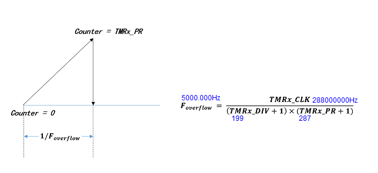

<!--
 * @Author: 小土坡 xiaotupo@163.com
 * @Date: 2025-04-14 22:42:16
 * @LastEditors: 小土坡 xiaotupo@163.com
 * @LastEditTime: 2025-04-14 22:57:46
 * @FilePath: \MDK_V5d:\projects\at32_examples\led_blink\docs\at32f437修改PWM频率笔记.md
 * @Description: 
 * 
 * Copyright (c) 2025 by 小土坡, All Rights Reserved. 
-->
# AT32 PWM 频率设置笔记

