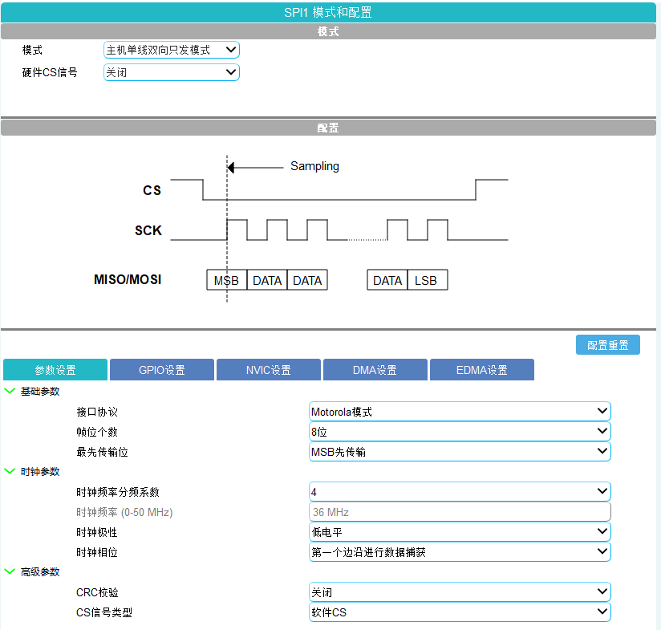

# 项目介绍

硬件平台：**AT32F437ZGT7** + **AT32 Work Bench**(图形化配置工具) + **MDK5**

用到了：

- FreeRTOS
	- 二值信号量
- DMA + SPI
	- DMA 发送完成中断

**AT32 Work Bench** 配置

- SPI 配置如下

spi 基础配置：

dma 配置:

开启中断

## 工作流程

- 先初始化 ST7789 (使用非 DMA 模式)，需调用 lcd_set_to_non_dma_mode() 函数
- 写DMA中断处理，在中断发送完成中清除发送完成中断标志位，并发送二值信号量通知任务 DMA 已写完

## 目前的性能

目前没有使用双缓冲，最高全屏刷新率在 24。

目前只实现了，全屏填充，下一步会基于该例子移植 LVGL。

